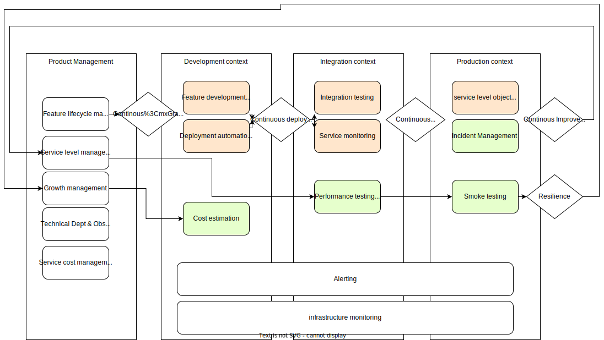
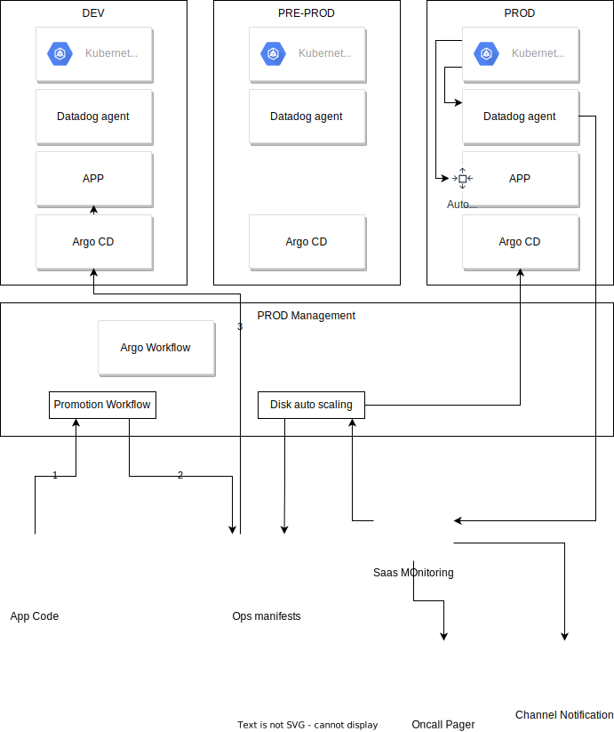

# monitoring_and_cd
## Context

A monolithic application will be split progressively into multiple services.
Each service can be managed and developed by independent development teams. This transition aims to give flexibility to the deployment process, delivery calendar, improve the feature scaling, growth, and secure services interaction, availability, and scalability to provide a qualitative service to customers.

## Challenges
Delivering multi-services that can interact between them require stimulating some concepts to be safe and confident in the features delivery process, exploitation, and quality:

* continuous service deployment
* integration testing
* cost management
* service and infrastructure monitoring and alerting
* troubleshooting and tracing
* incident management
* service level objectivation
* chaos testing and resilience
* autonomous and responsibilization of features teams
* service performance, rate-limiting, and quotas management
* production operation definition (storage resizing,... )
* obsolescence management
* data security
* rollback management

In this study, I only cover continuous service delivery and monitoring concepts, but other concepts can be introduced depending on the service criticality and team maturity.
Those other processes can be introduced either at the beginning of the continuous delivery implementation or just after in a continuous improvement process.

Those concepts can be applied in the same way for products and services exposed to customers than for the platform infrastructure and service provided for the internal teams.

## Roadmap

### Continous Delivery
Delivering a service requires developing the feature.
But it's not enough. A feature must be deployed on technical infrastructure and interact with some technical component or tiers services that are managed internally or externally.

The first challenge before automating the delivery is to secure the service integration on the infrastructure target. Continuous deployment testing will help identify regressions and compatibility breaks between development and infrastructure.

The second challenge is monitoring all components that contribute to delivering the service. This includes the infrastructure part but also the application part with technical metering, event, logs but also business metrics to anticipate feature usage growth or incident detection

The third step is defining and implementing the Service Level Object to evaluate the quality of service expected. This will help the infrastructure and development teams to challenge the delivery quality and make the teams responsible for the positive or negative impacts on the quality of service perceived by customers. The service level objectification makes it possible to balance efforts between the development of new functionality and the reliability of the delivered service.

Now that the deployment is tested, the integration with tiers services is validated, and the quality of service is measured, we can safely embrace the continuous delivery process.

The fourth step is implementing monitoring and alerting to leverage the service level objective. Monitoring needs to be implemented at the infrastructure, feature, and service levels.

Those four steps only cover the continuous delivery. This process needs to be enriched with other aspects like performance testing, auto-scaling, and financial management of service run to cover the product cost optimization and activity growth.

### Monitoring / Alerting
Monitoring is the process of collecting metrics and logs.
Monitoring needs to be implemented at multiple levels:
* Infrastructure component (error, usage, latency, ...)
* Infrastructure service (for quotas and rate-limiting usage, ...)
* Application component (availability, storage, tracing, load)
* Business service (usage, latency, availability, ...)

The alerting is here to quickly detect some known situation, issue or abnormal usage. Alert can be declined on three types:
* Notification - it's the low level; the product team can use it to track some usage or expected level but without direct impact on the SLO
* Event - it can trigger some operation pipeline automation like disk increase.
* Pager - it's the highest level that requires an immediate intervention like an on-call with an incident opening and a postmortem

## Technical Architecture
### Global Architecture

### Application Architecture

## Components And Services choices
| Component | Choice | Why |
|-----------|--------|----------|
|container orchestration | Kubernetes managed| it's the leading actor; available on all major cloud providers |
| App templating | Kustomize | Because helm is probably overkilling for unique and straightforward app deployment|
| Continuous deployment | Arco CD | Because il's more than a CD on their ecosystem |
| Promotion et operation Pipeline | Argo Workflow | Mature project hosted by the CNCF; implement Multi-tenancy, many event providers. Can be coupled with monitoring, alerting, dev tools, ... |
| Infrastructure deployment | AWS Controllers for Kubernetes (ACK) or Google Config Connector | Use Kubernetes CRD to deploy infrastructure resources; help dev teams to contribute without learning another techno like Terraform|
| Monitoring | Datadog | Because it's a SaaS service that allows the platform team to be focused on providing dashboard, SLI, SLO, alerting. Easy to scale, resilient and secure. Where an ELK or Prometheus requires a full-time team to administrate, scale, and secure. |

